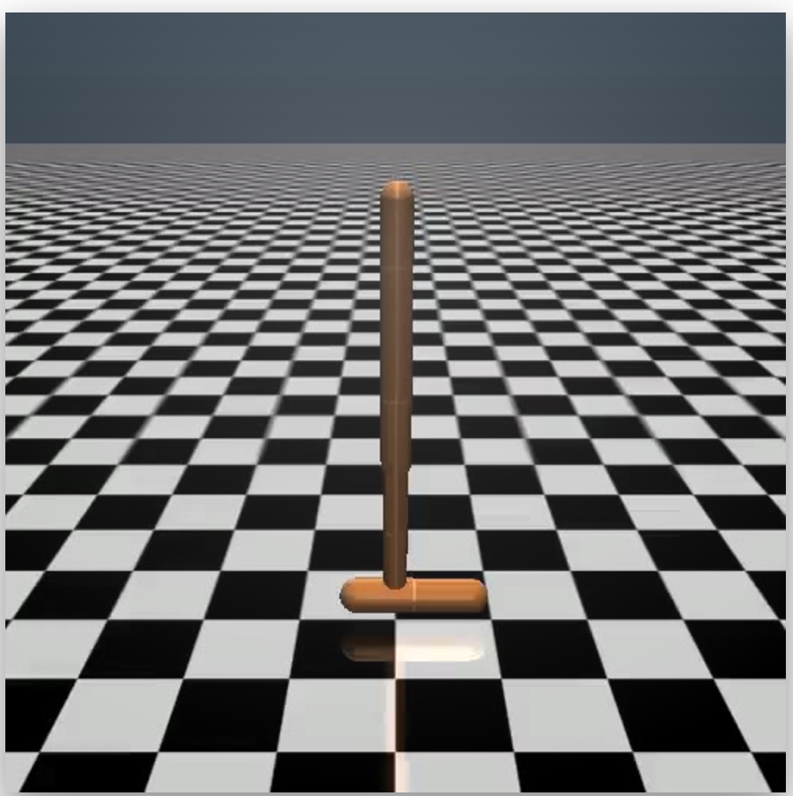

# Sim-to-Real transfer of Reinforcement Learning policies in robotics - Project5_MLDL

This repository contains the implementation of the concepts described in our work: "titolo paper" for the Machine Learning and Deep Learning course project on Reinforcement Learning in the context of robotic systems.
 
# Description

Reinforcement Learning is considered a new paradigm, different from Supervised and Unsupervised Learning, its strength is represented by the possibility offered to an agent to learn how to behave from its actions.

First of all, this project aims to reproduce some algorithms presented in the state-of-the-art, such as: 

*  REINFORCE with Baseline
*  Actor-Critic
*  Trust Region Policy Optimization (TRPO)
*  Proximal Policy Optimization (PPO)

Moreover, it focuses on the transferring of policies from the simulated world to the real one (that in our case is represented by another simulator, different from the source only for the first mass, shifted of 1 kg).
In order to face the reality gap, due mainly to the difficulty to model parameters of the real world in simulation, concepts like Domain Randomization  (DR) and Adaptive Domain Randomization have been explored. The implementation of the first foresees the randomization of the masses, sampling from Uniform Distributions. Finally, to improve some limits of the DR, an implementation of the Simopt is provided.

# Getting Started
## Dependencies

   ### Local Version

      Install dependencies:

      Install MuJoCo and the python mujoco interface following the instructions here: https://github.com/openai/mujoco-py
      Install gym: pip install gym
      

## SimOpt algorithm
    main.py file contains the code needed to launch several iterations of the SimOpt algorithm, to get the optimal distribution found and to use it to train an agent in the source target and test its performances on the target environment.
    
    
    To launch it:
    python3 main.py --device <device> --training_algorithm <training_algorithm> --initialPhi <initialPhi> --normalize --logspace --budget <budget> --n_iterations <n_iterations> --T_first <T_first> --algorithm_parameters_filePath <filePath> --episodes <episodes> --render
    Possible arguments.
    <device>: device [cpu, cuda], default='cpu'
    <training_algorithm>: training algorithm [PPO, TRPO], default='PPO'
    <initialPhi>: initial values for phi [fixed, random], default='fixed'
    --normalize: normalize dynamics parameters search space to [0,n] (n depends on the implementation), default=False
    --logspace: use a log space for variances (makes senses only if 'normalize' is set to True), default=False
    <budget>: number of evaluations in the optimization problem (i.e.: number of samples from the distribution), default=1000
    <n_iterations>: number of iterations in SimOpt algorithm, default=1
    <T_first>: T-first value in discrepancy function [max, min, fixed:<number>], default='max'
    <filePath>: path of the file with the values of the algorithm parameters, default=None
    <episodes>: number of test episodes, default=50
    --render: render the simulator, default=False
    
    
        If the path of the file is not passed as an argument, the defaults parameters values are considered.
    Format of the file.
    <parameter name>:<parameters values separated by a single space>\n
    ...
    <parameter name>:<parameters values separated by a single space>
       -- If <parameter name> is missing for a specific parameter, the default values are considered for that parameter. 
       -- <parameter name> possible choices: <phi_initial_values>, <phi_bounds>, <length_normalized_space>, <importance_weights>, <norms_weights>.

    default values:
      phi initial values:4.5 1 2.8 1 4.5 1
      phi bounds:0.7 8.5 0.00001 2 0.7 8.5 0.00001 2 0.7 8.5 0.00001 2
      length normalized space:4
      importance weights:1 1 1 1 1 1 1 1 1 1 1
      norms weights:1 1

# Authors

* Giovanni Cadau
* Federica Lupo
* Luca Viada

